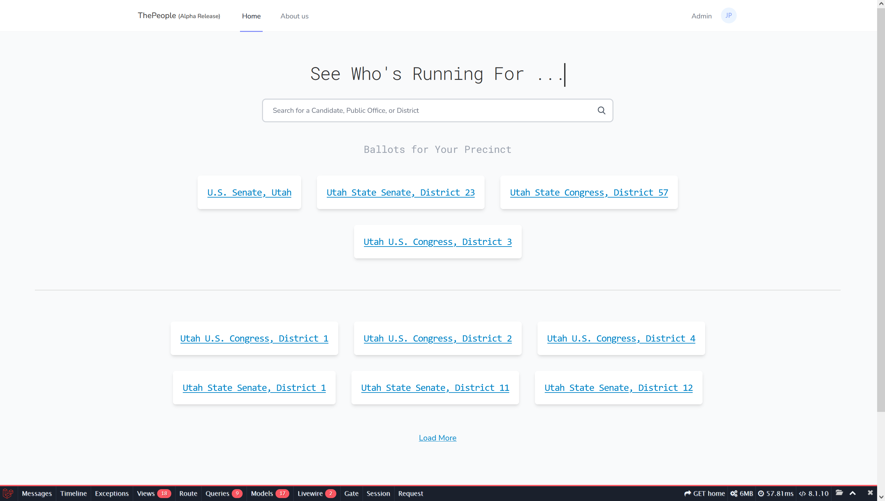
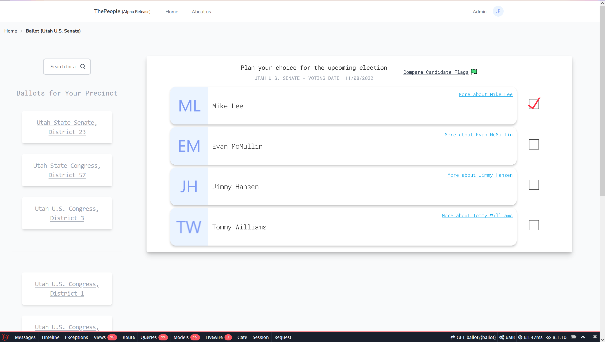
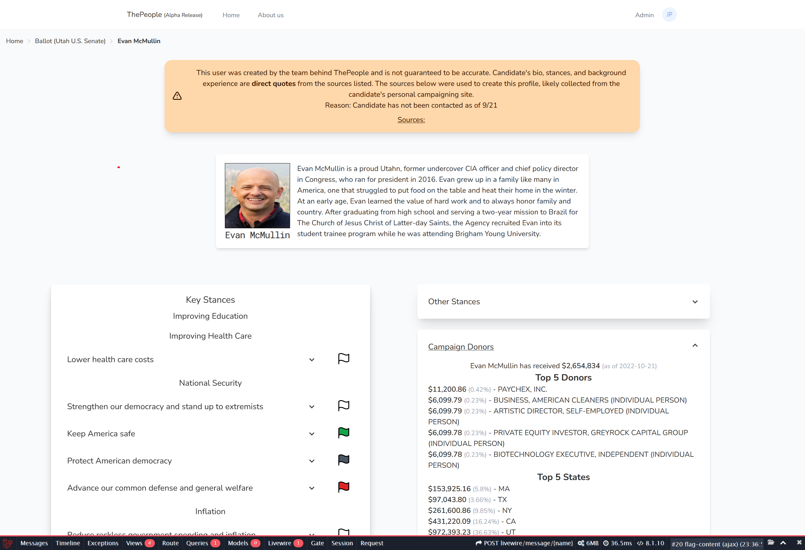
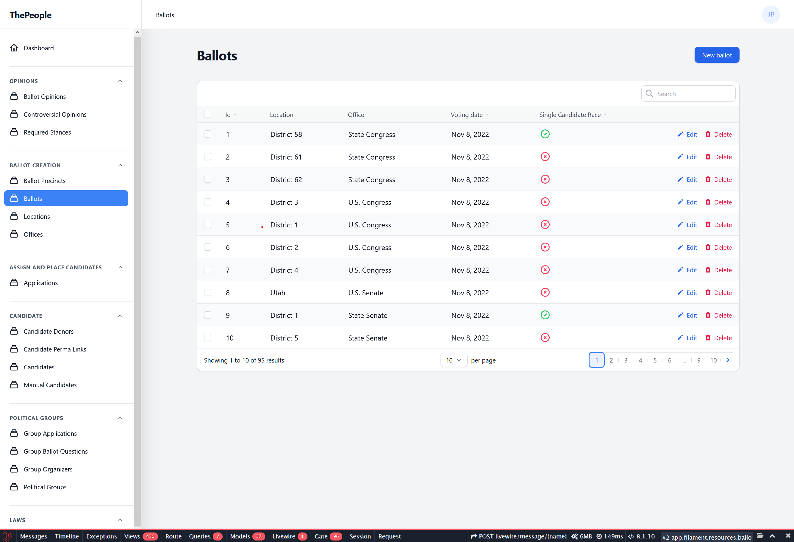

# ThePeople

ThePeople was a website created with the intent of making a "one-stop shop" for political information. It's built on the TALL stack and the data was populated from a pipeline of site scrapers and data cleaners.

## The Home Page

The home page shows a lazy loaded list of all ballots that have at least one candidate that is showing their profile. After registering, users could input their address to have the home screen show them the ballots their precincts.

## A Ballot

Ballots will list all candidates for their election. Registered users can plan out their votes and email themselves their voting list. An (unfinished) flag comparison page would allow users to side-by-side compare candidates after flagging information in the candidate's profile.

## A Candidate

A candidate's page would display a bio, donors, controversial & general stances, education, and work experience. If the candidate has previously held office their previous positions & legislation they've voted on will appear.

## Admin Panel

The admin panel was created with a huge thanks to [filament PHP](https://filamentphp.com/). The admin panel basically makes this site a glorified CMS.

Candidates have their own special admin page to edit their profiles.

## Final Notes

Thanks for looking at my repo! I learned a lot from creating this site and I will likely look back at this as one of the earlier works I created. If you've found this since you're creating something similar, feel free to message me about help using this.

## License

This repository is open-sourced software licensed under the [MIT license](https://opensource.org/licenses/MIT).
